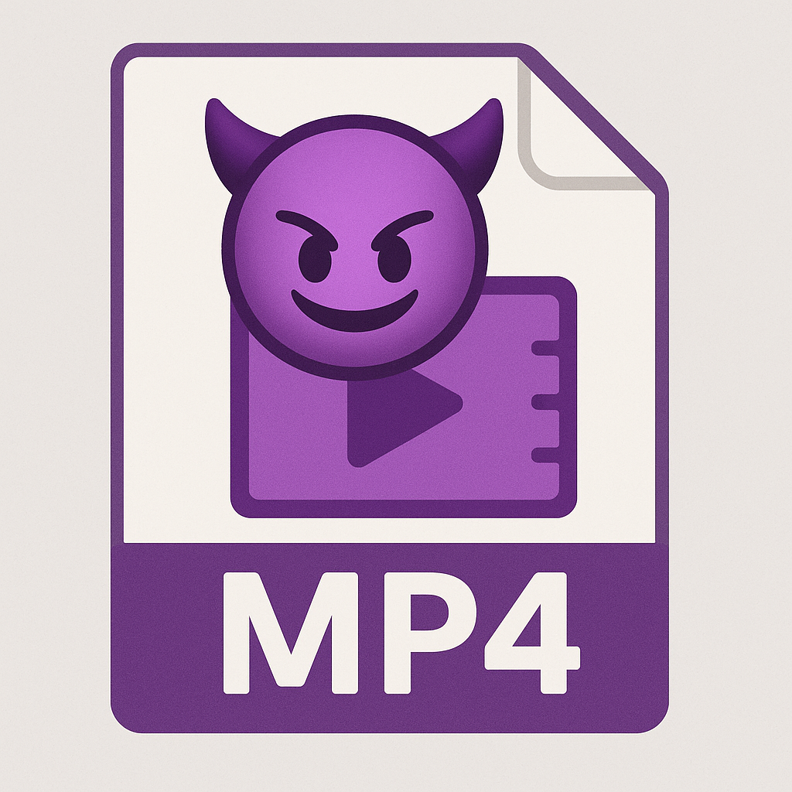

# video-fuzzing



Tools for creating media files to attack video processing software using AI.

## Description

AI is used to process videos to identify, summarize and make decisions on the content. Multiple AI and deterministic
techniques are used. Object identification, optical character recognition (OCR), large-language models (LLM) are some
of these techniques.

There is an attack surface in this space that needs to be investigated and secured. The tools in this repo produce videos
to help testers to identify weaknesses.

**Note**: This code was written with assistance from an LLM. A live engineer with real development skills is responsible
for the code.

## Attack Surface

The following are the areas the tools target.

### Containers

A container is how the video content is stored, such as MP4, MKV, MOV, etc. There are attacks that depend on the container.
For example, MKV can hold multiple audio and subtitle tracks. Think about what an LLM will do with multiple tracks that
have conflicting content.

MP4 is the primary container in these tools, although `ffmpeg` is used for the actual AV work, and it supports a lot of
containers. The container is usually chosen by the filename extension. For tools that accept an output filename, try the
container you want and see if it works. Some will not because of limitations such as only accepting one audio track or
not supporting subtitles.

### Frame Rate

The number of frames per second directly influences the quality and size of the video. Processing of individual frames (images)
is necessary for object identification and OCR. If the process takes every fifth frame, we can increase the process
requirements by increasing the frame rate.

### Video Codec

The video codec, such as H.264 or H.265/HEVC, determines how the frames are compressed to save bandwidth. Some codecs
do a better job than others. If the input validation of a video is solely based on number of bytes, we can squeeze longer
videos in that size by providing frames that can be compressed well, such as solid colors.

### Audio and Subtitles

Audio transcriptions and subtitles may be fed to the LLM. If these tracks have different content, the LLM may prefer
one over the other. Guard rails meant to keep the LLM from disclosing confidential data or system prompts may not
operate on all tracks. The tools can produce videos like this. By using the command line wisely, existing LLM injection
word lists can feed into the videos.

## Installation

You'll need [ffmpeg](https://ffmpeg.org). It's the most popular open-source, command line AV tool.

For text-to-speech, `say` is used on macOS, [`espeak`](https://github.com/espeak-ng/espeak-ng/) is used on other platforms.

The Homebrew bundle feature can be used for macOS and Linux:
```shell
brew bundle
```

On Linux or Windows with WSL:
```shell
apt-get install ffmpeg espeak-ng || yum install ffmpeg espeak-ng
```

## Usage

All tools have help available with the `--help` option, it is the authoritative documentation.

### video-high-scene-rate.py

When processes detect scene changes, aka chapters, we want to make a video with a LOT of them. The trade-off is to
keep the video a reasonable size. This script makes "scenes" using solid colors, random noise or from a list of images.

```commandline
usage: video-high-scene-rate.py [-h] [--output OUTPUT] [--width WIDTH] [--height HEIGHT] [--frame_rate FRAME_RATE] [--total_frames TOTAL_FRAMES] [--frames_per_scene FRAMES_PER_SCENE] [--random-noise]
                                [--mixed-scenes] [--codec {h264,h265}] [--scene-label SCENE_LABEL] [--image-list IMAGE_LIST] [--shuffle-images] [--add-audio]

Generate video with excessive scene changes.

optional arguments:
  -h, --help            show this help message and exit
  --output OUTPUT       Output video file
  --width WIDTH         Video width
  --height HEIGHT       Video height
  --frame_rate FRAME_RATE
                        Frames per second
  --total_frames TOTAL_FRAMES
                        Total number of frames in output
  --frames_per_scene FRAMES_PER_SCENE
                        Number of frames per scene
  --random-noise        Use only random noise for scenes
  --mixed-scenes        Randomly mix noise, color, and images
  --codec {h264,h265}   Video codec to use
  --scene-label SCENE_LABEL
                        Path to text file with scene labels (0–255 chars per line)
  --image-list IMAGE_LIST
                        Path to text file with image filenames (one per line)
  --shuffle-images      Shuffle the image list before use
  --add-audio           Add mono 4kHz white noise audio track
  --verbose             Verbose output
```

Examples:
- [video-high-scene-rate1.mp4](docs/video-high-scene-rate1.mp4)
- [video-high-scene-rate2.mp4](docs/video-high-scene-rate2.mp4)

### text-to-video.py

Especially for LLMs, we want video with readable text in the video, audio and subtitles. We may want that text
to be mismatched.

```commandline
usage: text-to-video.py [-h] [--fontsize FONTSIZE] [--duration DURATION] [--output OUTPUT] [--fontcolor FONTCOLOR] [--background BACKGROUND] [--maxwidth MAXWIDTH] [--volume VOLUME] [--margin MARGIN] [--tts]
                        [--tts-text TTS_TEXT] [--subtitle-text SUBTITLE_TEXT] [--subtitle-language SUBTITLE_LANGUAGE]
                        ...

Generate a video with text, optional Text-to-Speech, and optional embedded subtitles.

positional arguments:
  text                  Text to display and/or speak

optional arguments:
  -h, --help            show this help message and exit
  --fontsize FONTSIZE   Font size in pixels (default: 32)
  --duration DURATION   Duration of the video in seconds (default: 10)
  --output OUTPUT       Output filename (default: output.mp4)
  --fontcolor FONTCOLOR
                        Font color (default: white)
  --background BACKGROUND
                        Background color (default: black)
  --maxwidth MAXWIDTH   Maximum video width in pixels (default: 1280)
  --volume VOLUME       White noise volume in dB (default: -30)
  --margin MARGIN       Margin around the text in pixels (default: 10)
  --tts                 Use TTS audio instead of white noise
  --tts-text TTS_TEXT   Alternate text to use for TTS (default: same as visible text)
  --subtitle-text SUBTITLE_TEXT
                        Alternate text to use for subtitles (default: same as TTS text, which defaults to visible text)
  --subtitle-language SUBTITLE_LANGUAGE
                        Subtitle language code (default: eng)
```

Examples:
- [text-to-video1.mp4](docs/text-to-video1.mp4)

### text-to-image.py

Produce images from text, intended to test OCR.

```commandline
usage: text-to-image.py [-h] [--fontsize FONTSIZE] [--fontfile FONTFILE] [--output-dir OUTPUT_DIR] [--list-file LIST_FILE] [--fontcolor FONTCOLOR] [--background BACKGROUND] [--maxwidth MAXWIDTH]
                        [--maxheight MAXHEIGHT] [--margin MARGIN]
                        ...

Generate a series of images from text.

positional arguments:
  text                  Text to display across images

optional arguments:
  -h, --help            show this help message and exit
  --fontsize FONTSIZE   Font size in pixels (default: 32)
  --fontfile FONTFILE   Path to a TTF/OTF font file
  --output-dir OUTPUT_DIR
                        Directory to save output images
  --list-file LIST_FILE
                        Write the list of image paths to this file
  --fontcolor FONTCOLOR
                        Font color (default: white)
  --background BACKGROUND
                        Background color (default: black)
  --maxwidth MAXWIDTH   Maximum image width (default: 1280)
  --maxheight MAXHEIGHT
                        Maximum image height (default: 720)
  --margin MARGIN       Margin in pixels (default: 10)
```

### mp4_datetime_fuzzer.py

Videos have timestamps in the frames. Let's fuzz those to see if something breaks :)

```commandline
usage: mp4_datetime_fuzzer.py [-h] --input INPUT [--output OUTPUT] [--count COUNT] [--atoms {mvhd,tkhd,mdhd,stts,elst,edts} [{mvhd,tkhd,mdhd,stts,elst,edts} ...]] [--bit-depth {32,64}]
                              [--fields {creation,modification,both}] [--fuzz-fields FUZZ_FIELDS] [--log LOG] [--min-value MIN_VALUE] [--max-value MAX_VALUE] [--signed] [--value-mode {random,boundary,mixed}]
                              [--seed SEED] [--dry-run] [--hash]

MP4 datetime fuzzer (large-file safe, flexible)

optional arguments:
  -h, --help            show this help message and exit
  --input INPUT, -i INPUT
                        Input MP4 file
  --output OUTPUT, -o OUTPUT
                        Directory for fuzzed files
  --count COUNT, -n COUNT
                        Number of output files to generate
  --atoms {mvhd,tkhd,mdhd,stts,elst,edts} [{mvhd,tkhd,mdhd,stts,elst,edts} ...]
                        Atom types to fuzz: movie header (mvhd), track header (tkhd), media header (mdhd), time-to-sample (stts), edit list (elst), edit box (edts)
  --bit-depth {32,64}   Field size: 32 or 64-bit
  --fields {creation,modification,both}
                        Fields to fuzz
  --fuzz-fields FUZZ_FIELDS
                        Number of timestamp fields to fuzz per file
  --log LOG             CSV file to log fuzzed changes
  --min-value MIN_VALUE
                        Minimum value to use for fuzzing
  --max-value MAX_VALUE
                        Maximum value for fuzzing
  --signed              Use signed integer ranges
  --value-mode {random,boundary,mixed}
                        Value generation strategy
  --seed SEED           Random seed for reproducibility
  --dry-run             Do not write files, simulate only
  --hash                Append SHA256 hash of content to filename
```

### scatter_bytes.py

This script writes random bytes throughout a file. It isn't specifically for videos. (You could try it on your hard drive to see how resilient the filesystem is.)

```commandline
usage: scatter_bytes.py [-h] [--byte-set BYTE_SET [BYTE_SET ...]] [--length LENGTH] [--count COUNT] [--spacing SPACING] file

Scatter random bytes into a binary file.

positional arguments:
  file                  Path to the binary file to modify

optional arguments:
  -h, --help            show this help message and exit
  --byte-set BYTE_SET [BYTE_SET ...]
                        Set of hex byte values to use (e.g., 00 ff aa)
  --length LENGTH       Length of each modification in bytes
  --count COUNT         Number of random modifications to perform
  --spacing SPACING     Minimum number of bytes between modifications (optional)
```

### lorem.py

When text is needed of a certain size, the `lorem.py` tool can generate the Lorem Ipsum text until a given size is reached.

```commandline
usage: lorem.py [-h] -b BYTES [--min MIN] [--max MAX]

Generate Lorem Ipsum text of a specific size in bytes.

optional arguments:
  -h, --help            show this help message and exit
  -b BYTES, --bytes BYTES
                        Desired output size in bytes
  --min MIN             Minimum words per sentence
  --max MAX             Maximum words per sentence
 ```
